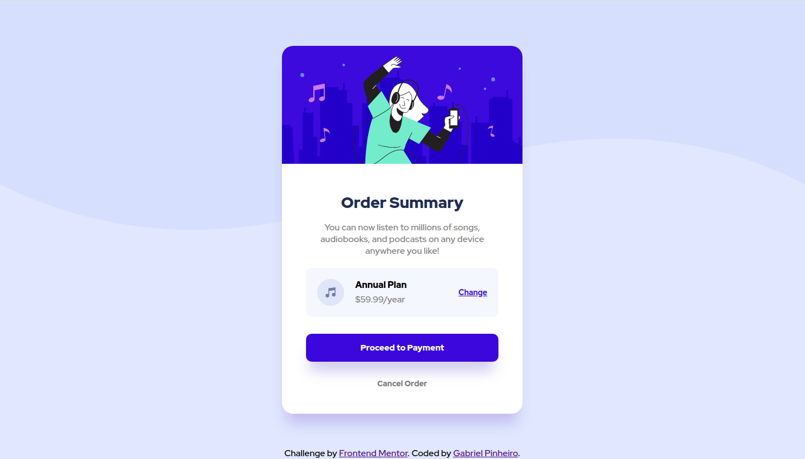
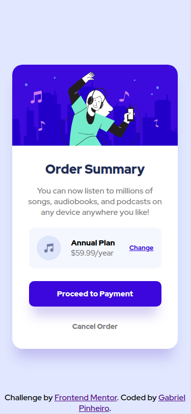

# Frontend Mentor - Order summary card solution

This is a solution to the [Order summary card challenge on Frontend Mentor](https://www.frontendmentor.io/challenges/order-summary-component-QlPmajDUj). 

## Table of contents

- [Overview](#overview)
  - [The challenge](#the-challenge)
  - [Screenshot](#screenshot)
  - [Links](#links)
- [My process](#my-process)
  - [Built with](#built-with)
  - [What I learned](#what-i-learned)
  - [Useful resources](#useful-resources)
- [Author](#author)

## Overview

### The challenge

Users should be able to:

- See hover states for interactive elements

### Screenshot




### Links

- Solution URL: [Add solution URL here](https://your-solution-url.com)
- Live Site URL: [Add live site URL here](https://your-live-site-url.com)

## My process

### Built with

- Semantic HTML5 markup
- CSS custom properties
- Flexbox
- Mobile-first workflow

### What I learned

```css
/* media queries */
@media screen and (min-width: 1100px) {
  body {
    background-image: url("../images/pattern-background-desktop.svg");
    background-repeat: no-repeat;
    background-size: 100% 50%; 
    background-color: hsl(225, 100%, 94%);
  }

  main {
    max-width: 430px;
  }

  h1 {
    font-size: 28px;
    margin: 50px 0 0 0;
  }

  .description-plan {
    margin: 15px 60px 10px 60px;
  }

  .price-container {
    margin: 10px 0;
    padding: 20px 20px;
  }

  .annual-plan-container p:nth-child(1)  {
    margin-bottom: 5px;
    font-size: 16px;
  }
  
  .annual-plan-container p:nth-child(2) {
    font-size: 16px;
  }

  .price-container a {
    font-size: 14px;
  }

  .confirm-btn {
    margin-top: 20px;
  }

  .cancel-btn {
    margin: 30px 0 45px 0;
  }
  
}
```
### Useful resources

- [CSS Box-Shadow Generator](https://cssgenerator.org/box-shadow-css-generator.html) - This helped me for generating box-shadows without going back and forth between the editor and the browser.

## Author

- Linkedin- [Gabriel Pinheiro](https://www.linkedin.com/feed/)
- Frontend Mentor - [@GabrielFMPinheiro](https://www.frontendmentor.io/profile/GabrielFMPinheiro)
- Codewars - [@GabrielFMPinheiroe](https://www.codewars.com/users/GabrielFMPinheiro)
